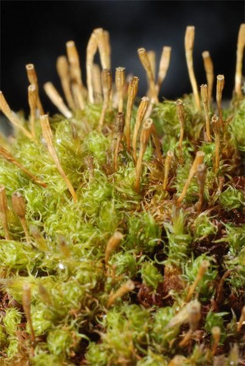

# Subclass Brievye

This is the most extensive and diverse subclass of all leafy mosses. The subclass includes about 14,000 species; almost 2,000 species are found in Russia. Unlike sphagnum mosses, brie mosses have thin rhizoids, mostly brownish in color. The cells of the rhizoids may contain a few chloroplasts and leukoplasts.

### Genus Polytrichum (Polytrichum)

Many species of this genus form sods in coniferous forests, meadows, bogs, where they contribute to the formation of peat deposits together with sphagnums. One of the tallest polytrichum mosses is common polytrichum moss. In Russia, it received the poetic name of cuckoo flax, the height of the stems of which can reach 50 cm, but its usual height is 15-25 cm.

On brownish, rather strong, even harsh stems, small bristle leaves are densely located.

Kukushkin flax is a dioecious plant. Sporogons, consisting of a capsule, a stem and its base, develop on female specimens of common polytrichum. Each sporogon capsule topped with a pointed cap bears some resemblance to a sitting cuckoo.

 
Perhaps that is why this type of leafy moss got such an amazing name as cuckoo flax.

There is one more structural feature of the common polytrichum sporogon, which could serve as a reason for its Russian name. The thin, downward-directed hairs extending from the easily falling cap of the sporogon are somewhat similar to linen yarn. So they called this type of moss - flax, and since in the forest you can often hear "cuckoo, cuckoo", we decided to associate the name with a cuckoo.

In the course of evolution - a long historical development - the cuckoo flax developed an interesting adaptation that ensures the preservation of spores in wet weather or during heavy rains.

 
Under the lid of the sporogon, along the edges of the capsule, there are cloves, which, in damp weather, curling inward, block the path of moisture to mature spores. And in dry weather, the teeth bend outward. Through the holes between them, spores spill out onto the soil when the bolls are swayed by the wind.

Rhizoids develop on the lower part of the cuckoo flax stems. They are like branchy hairs that attach the moss to the soil. Water absorption occurs to a greater extent on the entire surface of the stem and leaves.

Kukushkin flax grows most often not in the form of individual plants, but in dense sod, which, retaining and accumulating moisture, provide waterlogging of the place where they grow.

Kukushkin flax is the main component of the lower layer of the Russian taiga forests, which are called long-haired forests.

